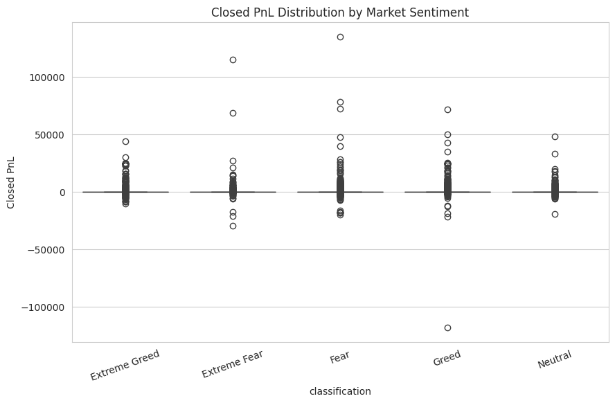
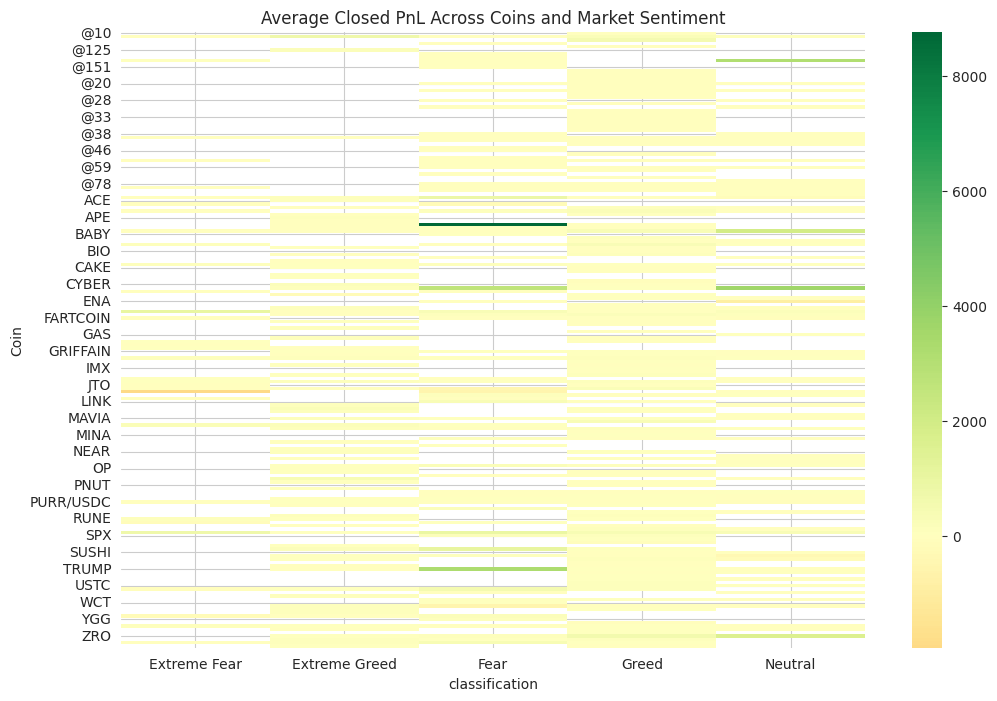
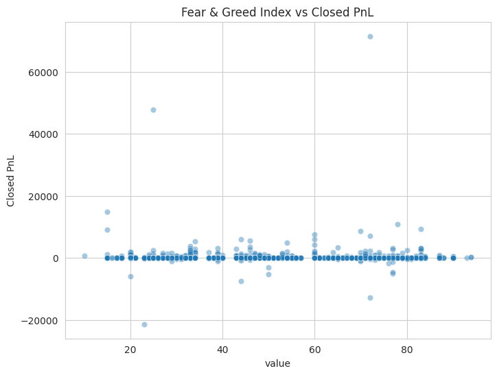

# Primetrade.ai - Trader Performance & Market Sentiment Analysis

<!-- Animated Typing Text -->

  

## 👩‍💻 About Me
Hi, I'm **Anaghashree**! I am currently studying at **MSRIT (Ramaiah Institute of Technology)** and have recently finished my **6th semester**. I have a strong passion for data analysis, exploring financial markets, and uncovering hidden patterns in complex datasets.

---

## 🚀 Assignment Overview
This project explores the relationship between trader performance and market sentiment, uncovering hidden patterns and delivering insights that can drive smarter trading strategies. 

The analysis is based on two primary datasets:
1. **Bitcoin Market Sentiment Dataset**: Contains Date and Classification (Fear/Greed).
2. **Historical Trader Data from Hyperliquid**: Includes account, symbol, execution price, size, side, time, start position, event, closedPnL, leverage, etc.

## 🛠️ Tools & Technologies Used
Here are the primary tools, libraries, and environments I used to build and analyze this project:

## 📂 Resources
- **Google Colab Notebook**: [View Analysis Notebook](https://colab.research.google.com/drive/1OfuvrEuQAXOTQ_qBmzveQmm0WmPIJXAY)
- **Project Report**: [View PDF Report](./Trader_Performance_Market_Sentiment_Report_Anaghashree.pdf)

## 📊 Results & Visualizations

<!-- Replace the line below with your actual image links using the format we discussed! -->
<!--  -->

